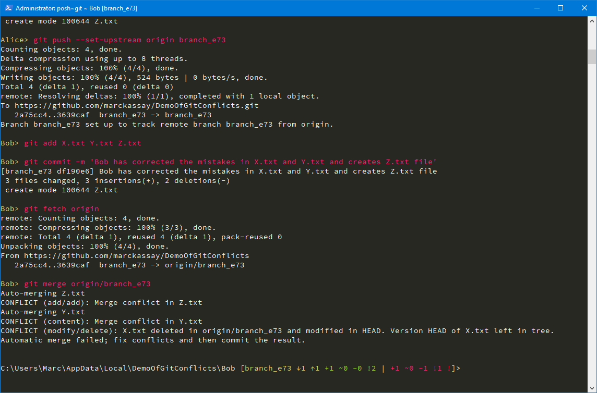

# DemoOfGitConflicts
Replicates by automation the following three Git conflicts:
* CONFLICT (content)
* CONFLICT (add/add)
* CONFLICT (modify/delete)

## Instructions
* Fork this project
* Clone your forked project 
* and dot-source AutomateCloning file!

## Explanation
When the ps1 file is dot-sourced, it will emulate Git activities by creating authors named Alice and Bob.  Alice will create and push careless mistakes that are in her work.  Bob will pull and see those mistakes which he then corrects.  When he pushes he will recieve the three conflicts mentioned above.

## Intentions
To demostrate quickly and effortlessly conflicts that occur when contributing to a centralized repository.  Also so that you're mindful of your actions which could be destructive when using Git.

I created this project during the time I was working on a bug fix for VSCode.  That bug was related to Git conflicts which replicating was cumbersome.

## Roadmap
* Demonstrate detached branches in a merge conflict
* Solutions for each scenario